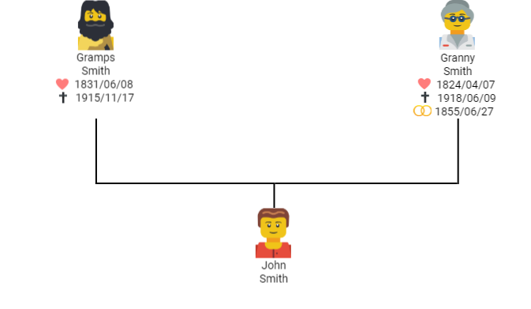
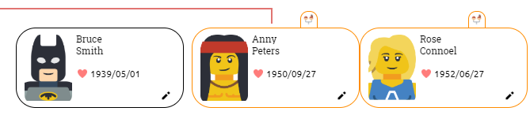

## Version 1.1.0
* Display of the wedding date in the chart and when exporting

| Chart                                                        | Export                                                       |
| ------------------------------------------------------------ | ------------------------------------------------------------ |
|  |  |

* Orange border around partners

* Icons for birth, death and wedding instead of the symbols (*, -) in the chart and the export files
   * can be overwritten in the export via a text prefix setting

| Old                                                          | New                                                          |
| ------------------------------------------------------------ | ------------------------------------------------------------ |
|  |  |

![[video-to-webp output image]](v1.1.0.assets/ezgif-2-3d12ce069fb6.webp)

* Performance improvement when creating the preview of the export :rocket:
* Add stacking of texts instead of individual definition of positions in export
    * Empty fields will automatically ignored

![[video-to-webp output image]](v1.1.0.assets/ezgif-2-374ff1641ec6.webp)

* Correction of the date display in grids
* All date fields now with 3 display modes (year, month and year, full)
   * This eliminates all "only the year of XXX is known" fields

![[video-to-webp output image]](v1.1.0.assets/ezgif-2-e1435bb50207.webp)

* The wedding date can also be specified in the partner of a person in the right editing panel

* Add link to sources
   
   * If the text begins with "http" or "www", another button appears to open this link directly
   
   ![[video-to-webp output image]](v1.1.0.assets/ezgif-2-7692c07605e3.webp)
